# SMARS Robot Wiring Schematic

## Component Connection Diagram

```mermaid
graph TB
    subgraph Arduino["Arduino Uno"]
        Pin2["Pin 2 (IR Signal)"]
        Pin7["Pin 6 (Ultrasonic TRIG)"]
        Pin8["Pin 7 (Ultrasonic ECHO)"]
        Pin10["Pin 10 (PWM - Motor A Speed)"]
        Pin11["Pin 11 (PWM - Motor B Speed)"]
        Pin12["Pin 12 (Motor A Direction)"]
        Pin13["Pin 13 (Motor B Direction)"]
        Pin4["Pin 4 (Buzzer)"]
        A_5V["5V"]
        A_GND["GND"]
    end
    
    subgraph IR["IR Receiver Module"]
        IR_S["S (Signal)"]
        IR_VCC["Middle Pin (VCC)"]
        IR_GND["- (GND)"]
    end
    
    subgraph HCSR04["HC-SR04 Ultrasonic Sensor"]
        US_VCC["VCC"]
        US_TRIG["TRIG"]
        US_ECHO["ECHO"]
        US_GND["GND"]
    end
    
    subgraph L298P["L298P Motor Driver Board"]
        IN1["IN1 (Ch A Dir)"]
        IN2["IN2 (Ch A Speed)"]
        IN3["IN3 (Ch B Dir)"]
        IN4["IN4 (Ch B Speed)"]
        L298_VCC["VCC (Logic Power)"]
        L298_GND["GND"]
        L298_MOTOR_PWR["Motor Power +"]
        L298_MOTOR_GND["Motor Power -"]
        OUT1["OUT1 Motor A+"]
        OUT2["OUT2 Motor A-"]
        OUT3["OUT3 Motor B+"]
        OUT4["OUT4 Motor B-"]
    end
    
    subgraph Motors["DC Motors"]
        MotorA["Motor A<br/>(Left Motor)"]
        MotorB["Motor B<br/>(Right Motor)"]
    end
    
    subgraph Power["9V Battery"]
        BAT_POS["+9V"]
        BAT_NEG["-"]
    end
    
    subgraph Optional["Optional Components"]
        Buzzer["Buzzer"]
    end
    
    %% IR Receiver Connections
    IR_S -->|Signal| Pin2
    IR_VCC -->|Power| A_5V
    IR_GND -->|Ground| A_GND
    
    %% HC-SR04 Connections
    US_VCC -->|Power| A_5V
    US_TRIG -->|Trigger Signal| Pin7
    US_ECHO -->|Echo Signal| Pin8
    US_GND -->|Ground| A_GND
    
    %% Arduino to L298P Connections
    Pin12 -->|Direction Control| IN1
    Pin10 -->|Speed Control PWM| IN2
    Pin13 -->|Direction Control| IN3
    Pin11 -->|Speed Control PWM| IN4
    A_5V -->|Logic Power| L298_VCC
    A_GND -->|Common Ground| L298_GND
    
    %% Battery to L298P
    BAT_POS -->|Motor Power| L298_MOTOR_PWR
    BAT_NEG -->|Ground| L298_MOTOR_GND
    BAT_NEG -->|Common Ground| A_GND
    
    %% L298P to Motors
    OUT1 -->|Positive| MotorA
    OUT2 -->|Negative| MotorA
    OUT3 -->|Positive| MotorB
    OUT4 -->|Negative| MotorB
    
    %% Optional Buzzer
    Pin4 -.->|Signal| Buzzer
    A_GND -.->|Ground| Buzzer
    
    style Arduino fill:#e1f5ff
    style IR fill:#ffe1e1
    style HCSR04 fill:#fff4e1
    style L298P fill:#e1ffe1
    style Motors fill:#fff9e1
    style Power fill:#ffe1f5
    style Optional fill:#f0f0f0
```

## Pin Connection Summary

### IR Receiver → Arduino
| IR Receiver Pin | Arduino Pin | Description |
|----------------|-------------|-------------|
| S (Signal)     | Pin 2       | IR data signal |
| Middle (VCC)   | 5V          | Power supply |
| - (GND)        | GND         | Ground |

### HC-SR04 Ultrasonic Sensor → Arduino
| HC-SR04 Pin | Arduino Pin | Description |
|-------------|-------------|-------------|
| VCC         | 5V          | Power supply |
| TRIG        | Pin 6       | Trigger pulse (output from Arduino) |
| ECHO        | Pin 7       | Echo pulse (input to Arduino) |
| GND         | GND         | Ground |

### Arduino → L298P Motor Driver
| Arduino Pin | L298P Pin | Function |
|------------|-----------|----------|
| Pin 12     | IN1       | Motor A Direction |
| Pin 10     | IN2       | Motor A Speed (PWM) |
| Pin 13     | IN3       | Motor B Direction |
| Pin 11     | IN4       | Motor B Speed (PWM) |
| 5V         | VCC       | Logic power |
| GND        | GND       | Common ground |

### 9V Battery → L298P Motor Driver
| Battery | L298P Pin | Function |
|---------|-----------|----------|
| + (9V)  | Motor Power + | Motor power supply |
| - (GND) | Motor Power - | Motor ground |

### L298P → Motors
| L298P Output | Motor Connection |
|--------------|------------------|
| OUT1         | Motor A Positive |
| OUT2         | Motor A Negative |
| OUT3         | Motor B Positive |
| OUT4         | Motor B Negative |

### Optional: Buzzer
| Arduino Pin | Buzzer Pin |
|------------|------------|
| Pin 4      | Positive (+) |
| GND        | Negative (-) |

## Important Notes

🤖 **Auto-Roaming Feature:**
- The HC-SR04 sensor enables autonomous navigation
- Robot will detect obstacles within 20cm and navigate around them
- Scans left and right to find the clearest path
- Activate with special button on IR remote (or 'a' command via serial)

⚠️ **Power Connections:**
- The 9V battery powers the motors through the L298P
- Arduino can be powered via USB (for programming/testing) OR from the L298P if it has a 5V output
- Ensure common ground between Arduino, L298P, and battery

⚠️ **Safety:**
- Double-check polarity on battery connections
- Ensure IR receiver is connected correctly (wrong polarity can damage it)
- Ensure HC-SR04 sensor is connected correctly
- Motors may draw significant current - ensure battery can handle the load

📝 **Motor Direction:**
- If motors spin in the wrong direction, swap the motor wires on L298P outputs
- Motor A typically controls left wheel
- Motor B typically controls right wheel

🎯 **Sensor Placement:**
- Mount HC-SR04 sensor at the front of the robot facing forward
- Sensor should be at least 2cm above ground
- Keep sensor clear of obstructions for accurate readings
